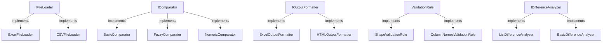
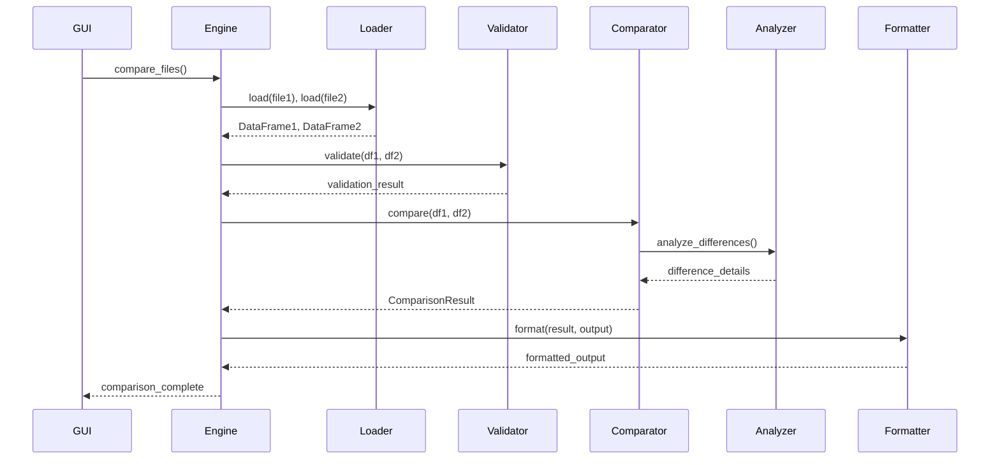

# 🏗️ Архитектура Excel Comparator

## Обзор архитектуры

Excel Comparator построен на основе **модульной архитектуры** с использованием принципов **SOLID**, что обеспечивает высокую расширяемость, тестируемость и поддерживаемость кода.

## 🎯 Архитектурные принципы

### 1. **Single Responsibility Principle (SRP)**
Каждый класс отвечает за одну конкретную задачу:
- `ExcelFileLoader` - только загрузка Excel файлов
- `BasicComparator` - только сравнение DataFrames
- `ExcelOutputFormatter` - только форматирование в Excel

### 2. **Open/Closed Principle (OCP)**
Система открыта для расширения, но закрыта для модификации:
```python
# Добавление нового компаратора без изменения существующего кода
engine.register_comparator("custom", CustomComparator())
```

### 3. **Liskov Substitution Principle (LSP)**
Все реализации интерфейсов взаимозаменяемы:
```python
# Любой IComparator может использоваться одинаково
comparator: IComparator = FuzzyComparator()  # или BasicComparator()
result = comparator.compare(df1, df2)
```

### 4. **Interface Segregation Principle (ISP)**
Интерфейсы разделены по функциональности:
- `IFileLoader` - загрузка файлов
- `IComparator` - сравнение данных
- `IOutputFormatter` - форматирование вывода

### 5. **Dependency Inversion Principle (DIP)**
Высокоуровневые модули не зависят от низкоуровневых:
```python
class ComparisonEngine:
    def __init__(self):
        self._comparators: Dict[str, IComparator] = {}  # Зависимость от абстракции
```

## 🔧 Компоненты системы

### Основные интерфейсы



### Центральный движок

```python
class ComparisonEngine:
    """Центральный компонент, координирующий работу всей системы"""
    
    def compare_files(self, file1: Path, file2: Path, output: Path, **options):
        # 1. Найти подходящий загрузчик
        loader = self._find_file_loader(file1)
        
        # 2. Загрузить данные
        df1 = loader.load(file1)
        df2 = loader.load(file2)
        
        # 3. Валидировать данные
        self._validate_data(df1, df2)
        
        # 4. Выполнить сравнение
        comparator = self._get_comparator(options.get('comparator', 'basic'))
        result = comparator.compare(df1, df2, **options)
        
        # 5. Отформатировать результат
        formatter = self._get_formatter(options.get('format', 'excel'))
        formatter.format(result, output, **options)
        
        return result
```

## 🔌 Система плагинов

### Регистрация компонентов

Все компоненты регистрируются в движке через единый интерфейс:

```python
# Регистрация загрузчика
engine.register_file_loader(CustomFileLoader())

# Регистрация компаратора
engine.register_comparator("advanced", AdvancedComparator())

# Регистрация форматтера
engine.register_formatter("json", JSONFormatter())

# Регистрация валидатора
engine.register_validation_rule(CustomValidationRule())
```

### Фабрики компонентов

Для упрощения создания компонентов используются фабрики:

```python
class ComparatorFactory:
    @staticmethod
    def create_comparator(type: str, **kwargs) -> IComparator:
        if type == "fuzzy":
            return FuzzyComparator(kwargs.get('threshold', 0.8))
        elif type == "numeric":
            return NumericComparator(
                abs_tol=kwargs.get('abs_tol', 1e-9),
                rel_tol=kwargs.get('rel_tol', 1e-9)
            )
        # ...
```

## 📊 Поток данных



## 🎨 Паттерны проектирования

### 1. **Strategy Pattern** (Стратегия)
Используется для выбора алгоритма сравнения:
```python
class ComparisonStrategy:
    def execute(self, file1: Path, file2: Path, output: Path, **options):
        # Различные стратегии сравнения
        pass
```

### 2. **Factory Pattern** (Фабрика)
Создание компонентов через фабрики:
```python
ValidationRuleFactory.create_standard_validators()
ComparatorFactory.create_comparator("fuzzy", threshold=0.9)
```

### 3. **Observer Pattern** (Наблюдатель)
Отчеты о прогрессе через `IProgressReporter`:
```python
def report_progress(self, current: int, total: int, message: str):
    self.progress_dialog.update_progress(current, total, message)
```

### 4. **Template Method** (Шаблонный метод)
Базовая структура для компараторов:
```python
class BaseComparator(IComparator):
    def compare(self, df1, df2, **options):
        self._validate_inputs(df1, df2)
        mask = self._create_differences_mask(df1, df2)
        metadata = self._collect_metadata(df1, df2, mask)
        return ComparisonResult(mask, df1, df2, metadata)
```

## 🔐 Обработка ошибок

### Иерархия исключений

```python
ApplicationError
├── FileLoadError
├── ComparisonError
├── ValidationError
├── UnsupportedFormatError
└── ConfigurationError
```

### Стратегия обработки

1. **Валидация на входе**: Проверка параметров перед выполнением
2. **Graceful degradation**: Мягкое ухудшение при ошибках
3. **Подробное логирование**: Контекст для диагностики
4. **Пользовательские сообщения**: Понятные сообщения об ошибках

## ⚡ Производительность

### Оптимизации

1. **Ленивая загрузка**: Компоненты создаются по требованию
2. **Потоковая обработка**: Большие файлы обрабатываются частями
3. **Кэширование**: Результаты анализа кэшируются
4. **Параллелизм**: Использование многопоточности для GUI

### Ограничения ресурсов

```python
class SizeValidationRule(IValidationRule):
    def __init__(self, max_rows: int = 100000, max_columns: int = 1000):
        self.max_rows = max_rows
        self.max_columns = max_columns
```

## 🧪 Тестирование

### Архитектура тестирования

```python
# Тестирование интерфейсов
class TestIComparator:
    def test_compare_returns_valid_result(self):
        comparator = BasicComparator()
        result = comparator.compare(df1, df2)
        assert isinstance(result, ComparisonResult)

# Мокирование зависимостей
@patch('src.loaders.excel_loader.pd.read_excel')
def test_excel_loader_handles_file_not_found(mock_read_excel):
    mock_read_excel.side_effect = FileNotFoundError()
    # Тест обработки ошибки
```

### Типы тестов

1. **Unit тесты**: Тестирование отдельных компонентов
2. **Integration тесты**: Тестирование взаимодействия
3. **End-to-end тесты**: Полный цикл сравнения
4. **Performance тесты**: Тестирование производительности

## 📈 Метрики качества

### Code Coverage
- Цель: >90% покрытия кода тестами
- Обязательное покрытие всех интерфейсов

### Complexity Metrics
- Цикломатическая сложность <10 для каждого метода
- Количество зависимостей <5 для каждого класса

### Documentation
- Docstrings для всех публичных методов
- Type hints для всех параметров и возвращаемых значений

## 🚀 Будущие расширения

### 1. Плагинная система
```python
class PluginManager:
    def load_plugin(self, plugin_path: Path):
        # Динамическая загрузка плагинов
        pass
    
    def register_plugin_components(self, plugin):
        # Автоматическая регистрация компонентов плагина
        pass
```

### 2. API сервер
```python
from fastapi import FastAPI

app = FastAPI()

@app.post("/compare")
async def compare_files(file1: UploadFile, file2: UploadFile):
    # REST API для сравнения файлов
    pass
```

### 3. Машинное обучение
```python
class MLComparator(IComparator):
    def __init__(self, model_path: Path):
        self.model = load_model(model_path)
    
    def compare(self, df1, df2, **options):
        # Использование ML для анализа различий
        pass
```

## 📚 Документация API

Все интерфейсы документированы с помощью docstrings:

```python
class IComparator(ABC):
    """
    Интерфейс для сравнения данных.
    
    Компараторы должны реализовывать этот интерфейс для обеспечения
    единообразного API сравнения различных типов данных.
    """
    
    @abstractmethod
    def compare(self, df1: pd.DataFrame, df2: pd.DataFrame, **options) -> ComparisonResult:
        """
        Сравнивает два DataFrame и возвращает результат.
        
        Args:
            df1: Первый DataFrame для сравнения
            df2: Второй DataFrame для сравнения
            **options: Дополнительные опции сравнения
            
        Returns:
            ComparisonResult: Результат сравнения с метаданными
            
        Raises:
            ComparisonError: При ошибке в процессе сравнения
        """
        pass
```

Эта архитектура обеспечивает:
- ✅ **Расширяемость**: Легкое добавление новых компонентов
- ✅ **Тестируемость**: Изолированное тестирование каждого компонента
- ✅ **Поддерживаемость**: Четкое разделение ответственности
- ✅ **Производительность**: Оптимизации на каждом уровне
- ✅ **Надежность**: Комплексная обработка ошибок